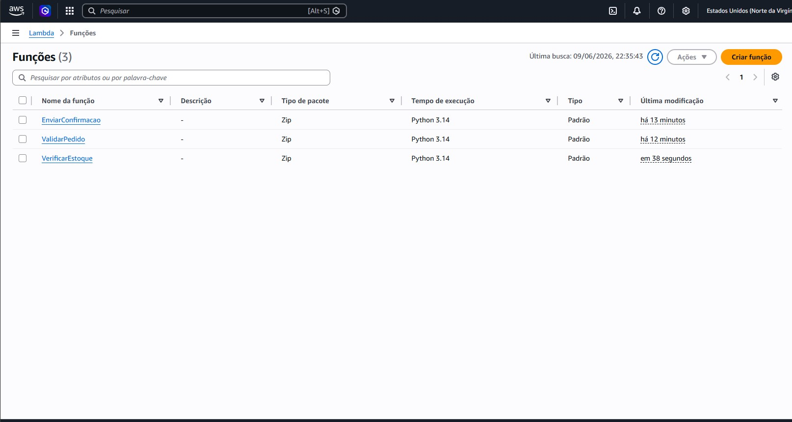
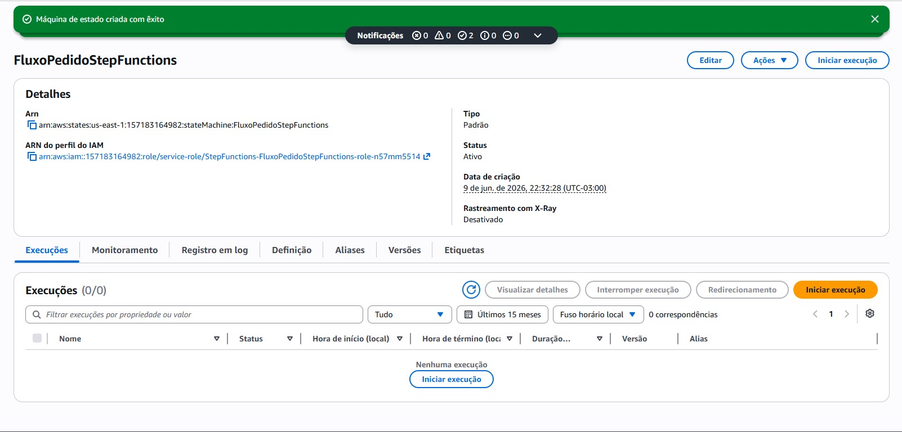
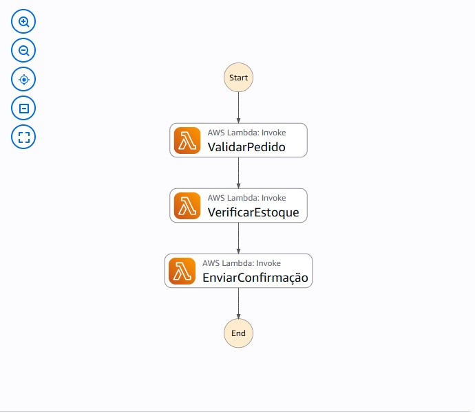
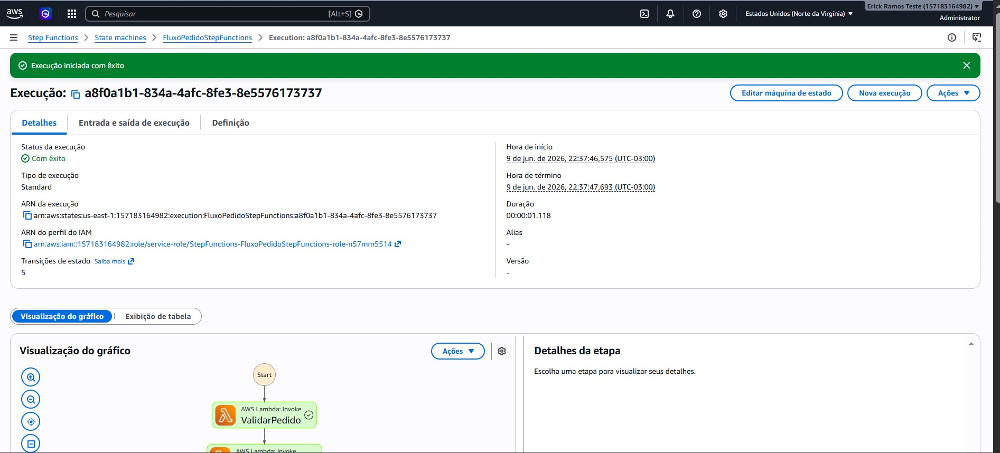

# Explorando Workflows Automatizados com AWS Step Functions

## Objetivo do Projeto

Este repositório foi criado como parte do desafio da DIO no bootcamp GFT - Fundamentos de Cloud com AWS.

O objetivo foi praticar a criação de um workflow automatizado utilizando o AWS Step Functions integrado com funções AWS Lambda.

Durante o laboratório, consegui visualizar melhor como diferentes etapas de um processo podem ser organizadas dentro da AWS de forma simples e visual.

## Serviços Utilizados

- AWS Step Functions
- AWS Lambda
- IAM
- AWS Management Console

## O que é AWS Step Functions?

O AWS Step Functions é um serviço da AWS utilizado para criar fluxos de trabalho automatizados, também chamados de workflows.

Na prática, entendi ele como uma forma de organizar um processo em etapas. Cada etapa pode chamar um serviço da AWS, como uma função Lambda, e o Step Functions controla a sequência de execução.

## O que é AWS Lambda?

O AWS Lambda é um serviço serverless que permite executar código sem precisar gerenciar servidores.

Neste projeto, as funções Lambda representam partes do processamento de um pedido. Cada função ficou responsável por uma ação específica dentro do fluxo.

## Fluxo Criado

O fluxo criado simula o processamento simples de um pedido.

Etapas:

1. ValidarPedido
2. VerificarEstoque
3. EnviarConfirmação

Primeiro o pedido é validado, depois o estoque é verificado e, por fim, uma confirmação é enviada.

## Arquitetura do Workflow

Usuário inicia execução

↓

AWS Step Functions

↓

Lambda ValidarPedido

↓

Lambda VerificarEstoque

↓

Lambda EnviarConfirmação

↓

Fim da execução

## Prints do Projeto

### Funções Lambda Criadas

### Máquina de Estado Criada

### Workflow no Step Functions

### Execução com Sucesso

## Minha Experiência

Esse foi meu primeiro contato prático com o AWS Step Functions.

A parte mais interessante foi perceber que o workflow deixa o processo muito mais fácil de entender visualmente. Antes da prática, eu via as funções Lambda como partes separadas. Depois do laboratório, ficou mais claro como elas podem trabalhar juntas dentro de um mesmo fluxo.

Também achei importante ver a execução finalizada com sucesso, porque isso ajudou a entender melhor o caminho que o pedido percorre desde o início até o fim.

## Aprendizados

Durante este laboratório, aprendi que o AWS Step Functions permite orquestrar múltiplas funções Lambda em um fluxo visual e organizado.

Também entendi melhor o conceito de workflow, onde cada etapa representa uma ação específica dentro de um processo maior.

Outro aprendizado importante foi perceber que serviços serverless podem ser combinados para criar soluções sem precisar gerenciar servidores diretamente. Isso ajuda bastante a entender como a AWS pode ser usada para automatizar processos de forma escalável.

## Conclusão

Esse laboratório ajudou bastante no entendimento do AWS Step Functions e da integração com o AWS Lambda.

Além de aprender os conceitos teóricos, foi possível criar um fluxo simples simulando o processamento de um pedido, passando pelas etapas de validação, verificação de estoque e envio de confirmação.

A atividade também foi importante para praticar a documentação de projetos utilizando GitHub e Markdown.